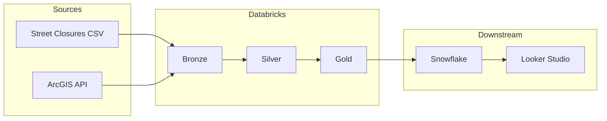

# tel-aviv-municipality-medallion-pipeline

PySpark Medallion pipeline for Tel Aviv municipality data (street closures CSV + ArcGIS businesses API), including Bronze/Silver/Gold tables, 2023 compensation outputs, audit table, scheduler job config, and dashboard-ready metrics.

## Prerequisites & Tech Stack

- Python 3.10+
- Databricks Runtime (Spark 3.x)
- Snowflake Account
- Looker Studio (for visualization)

## Architecture



- **Bronze**
  - `medallion.bronze_street_closures`
  - `medallion.bronze_businesses_features`
  - `medallion.bronze_street_segments`
- **Silver**
  - `medallion.silver_street_closures_daily`
  - `medallion.silver_street_segments`
  - `medallion.silver_businesses`
- **Gold**
  - `medallion.gold_business_annual_compensation_2023`
  - `medallion.gold_street_annual_compensation_2023`
  - `medallion.gold_dashboard_metrics_2023`
  - `medallion.gold_payout_assignment_2023`
  - `medallion.gold_payout_precision_2023`
  - `medallion.gold_audit_assignment_unmatched`
  - `medallion.gold_audit_precision_unmatched`

## Key business logic implemented

- Compensation year is limited to **2023**.
- Compensation is calculated once per business per day.
- Daily compensation formula:
  - `least(10000, shetach * 100)`
- Street matching uses `create_street_signature`:
  - retain Hebrew and digits; remove other characters
  - split to words
  - sort tokens
  - join to canonical street signature
- Unpivot protection:
  - if `me_shem_rechov` and `ad_shem_rechov` resolve to same signature, only one closure-street-day row is kept.
- `shetach` cleaning:
  - strip non-numeric chars, cast to `DoubleType`, null/non-positive -> `0.0`.
- Geometry preservation:
  - `geometry_json`, `x_coord`, `y_coord` are preserved in Silver/Gold for map visualizations.
- Segment-based eligibility refinement:
  - Bronze ingests ArcGIS Layer 507 street segments (Polyline, 8,800+ segments) with full `resultOffset` pagination.
  - Silver assigns each business to a street segment using ITM Euclidean point-to-polyline distance (with house-range fallback).
  - Gold compensates only businesses on impacted segment chains between closure start/end junctions.

## Data quality and idempotency

- All table writes are Delta **overwrite** mode with schema overwrite enabled.
- Each layer runs row-count validation checks:
  - Bronze source outputs
  - Silver normalized outputs
  - Gold final outputs
- Gold audit tables (`gold_audit_assignment_unmatched`, `gold_audit_precision_unmatched`) capture 2023 closures that did not result in payout, with detailed `audit_reason` (e.g. `INVALID_SOURCE_DATA`, `STREET_NOT_FOUND_IN_BUSINESS_DB`, `OUTSIDE_SPATIAL_IMPACT_ZONE`, `MATCHED_STREET_BUT_NO_ELIGIBLE_BUSINESSES`).

## GIS API (Layer 507) – getting geometry

Street segments are loaded from **Tel Aviv GIS MapServer Layer 507** (Polyline, full city map, 8,800+ segments).

- **Layer endpoint:**  
  `https://gisn.tel-aviv.gov.il/arcgis/rest/services/IView2/MapServer/507/query`  
  We use **outSR=4326** for WGS84 coordinates.

- **How we request geometry in code (Bronze):**  
  Every segment request sends:  
  `returnGeometry=true`, `outSR=4326`, `outFields=*`.  
  See `segment_extra_params` in `src/pipeline/bronze.py` → `ingest_street_segments_arcgis`.

## Run the pipeline

### Option A: Python entrypoint

From a Spark/Databricks environment where `spark` session is available:

```python
from src.pipeline.main import run_pipeline
outputs = run_pipeline(spark)
```

### Option B: Databricks notebook

Use:

- `notebooks/run_pipeline.py`

This notebook runs Bronze -> Silver -> Gold and displays top compensated businesses plus spatial audit output.

### Snowflake export

Gold payout precision is exported to Snowflake when `SNOWFLAKE_USER` and `SNOWFLAKE_PASSWORD` are set (e.g. via Databricks secrets). Optional env vars:

- `SNOWFLAKE_ACCOUNT` – Override the account identifier (default: `iz00241.eu-central-2.aws`). Use if you see `404 Not Found` on login.
- Account format: `orgname-accountname` or legacy `locator.region.cloud` (e.g. `iz00241.eu-central-2.aws` or `xy12345.us-east-1.aws`).
- Get the correct value from Snowsight: **Account selector → View account details → Account/Server URL** (omit `.snowflakecomputing.com`).

### Option C: Databricks Job (scheduled)

Bundle job is defined in root `databricks.yml`:

- job name: `tel-aviv-medallion-pipeline-job`
- task: `src/pipeline/main.py`
- default schedule timezone: `Asia/Jerusalem`

### Deploy to Databricks

1. **Install the Databricks CLI** (if not already installed):  
   [Installation guide](https://docs.databricks.com/dev-tools/cli/index.html).  
   Ensure the `databricks` command is on your PATH.

2. **Authenticate** (e.g. OAuth or profile):
   ```bash
   databricks auth login --host https://dbc-fae25079-a5f4.cloud.databricks.com
   ```
   Or set `DATABRICKS_HOST` and `DATABRICKS_TOKEN` (or use a [config profile](https://docs.databricks.com/dev-tools/cli/index.html#configuration)).

3. **Deploy the bundle** from the **repository root** (the folder that contains `databricks.yml`):
   ```bash
   # From repo root
   databricks bundle validate
   databricks bundle deploy -t dev
   ```

   This deploys the job to the workspace defined in `databricks.yml` under the `dev` target.

## Validation SQL checks

Run in Databricks SQL / Spark SQL:

```sql
-- 1) 2023 filter check
SELECT MIN(date), MAX(date)
FROM medallion.gold_payout_precision_2023;
```

```sql
-- 2) Daily cap check
SELECT MAX(payout_ils) AS max_daily_comp
FROM medallion.gold_payout_precision_2023;
```

```sql
-- 3) No duplicate compensation per business/day
SELECT business_id, date, COUNT(*) AS c
FROM medallion.gold_payout_precision_2023
GROUP BY business_id, date
HAVING COUNT(*) > 1;
```

```sql
-- 4) Unmatched closures audit coverage
SELECT COUNT(*) AS unmatched_rows
FROM medallion.gold_audit_assignment_unmatched;
```

```sql
-- 5) Audit reason distribution
SELECT audit_reason, COUNT(*) AS rows_count
FROM medallion.gold_audit_assignment_unmatched
GROUP BY audit_reason
ORDER BY rows_count DESC;
```

```sql
-- 6) Output row counts
SELECT "business_annual" AS dataset, COUNT(*) AS c FROM medallion.gold_business_annual_compensation_2023
UNION ALL
SELECT "street_annual" AS dataset, COUNT(*) AS c FROM medallion.gold_street_annual_compensation_2023
UNION ALL
SELECT "dashboard" AS dataset, COUNT(*) AS c FROM medallion.gold_dashboard_metrics_2023;
```

## BI & Dashboarding

The final Gold tables (`gold_dashboard_metrics_2023`, `gold_payout_assignment_2023`, `gold_payout_precision_2023`, and the audit tables) are exported to Snowflake and connected to **Looker Studio** for visualization.

Municipal decision-makers use the dashboard to:

- **Visualize compensation distribution** across streets and businesses
- **Compare Precision vs. Assignment models** (segment-based vs. street-signature-based eligibility)
- **Perform root-cause analysis** on unmatched closures using the audit tables (`gold_audit_assignment_unmatched`, `gold_audit_precision_unmatched`)

[Insert Screenshot of Looker Studio Dashboard Here]

## Dashboard spec (bonus)

Suggested visuals:

1. **Top compensated streets (bar chart)**  
   Source: `gold_street_annual_compensation_2023`
2. **Business compensation heatmap (map layer)**  
   Source: `gold_dashboard_metrics_2023` using `x_coord`/`y_coord` and `annual_compensation_ils`
3. **Cost per area distribution (histogram)**  
   Source: `gold_dashboard_metrics_2023` using `cost_per_area`
4. **Utilization KPI cards**  
   Source: `gold_dashboard_metrics_2023` using `compensation_utilization_pct`

## Assumptions

- Street matching is based on exact canonical signature equality.
- Spatial calculations are performed in ITM Cartesian coordinates (no WGS84 transformation).
- Businesses table is treated as latest known state and not time-sliced historically.
- Unmatched closure audit flags potential data gaps and spatial filtering outcomes.

## Future Enhancements & Optimizations

- **Spark Native Snowflake Connector:** The pipeline currently uses `.toPandas()` for Snowflake export, which works for the Tel Aviv dataset but would cause Out-Of-Memory (OOM) errors at national scale. Moving to the native Spark Snowflake connector will enable distributed writes and horizontal scaling.

- **Audit Logic Refactoring:** Continue abstracting and modularizing the PySpark `F.when().otherwise()` logic (e.g. via the existing `_audit_reason_column` helper) to maintain DRY principles as more audit reasons are added.

- **Incremental Processing:** For larger datasets, consider checkpointing and incremental Delta reads to avoid full table scans on each run.
